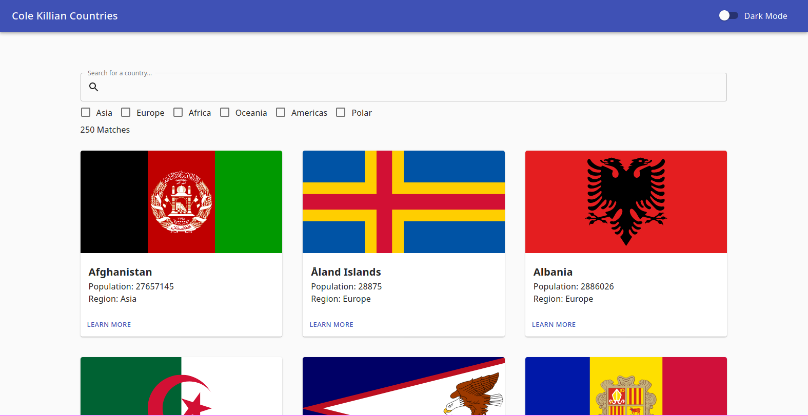
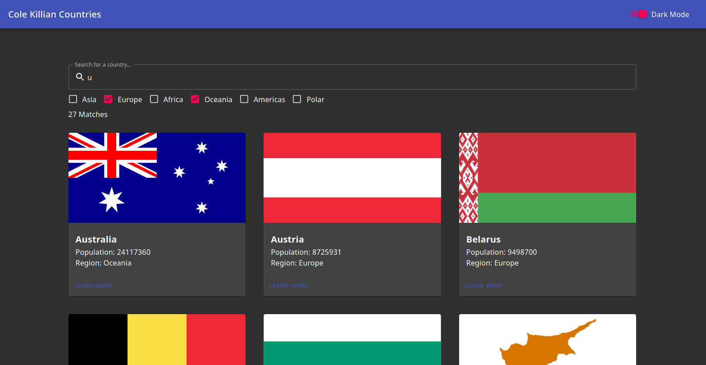
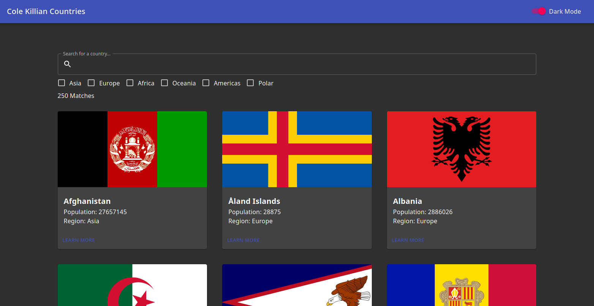
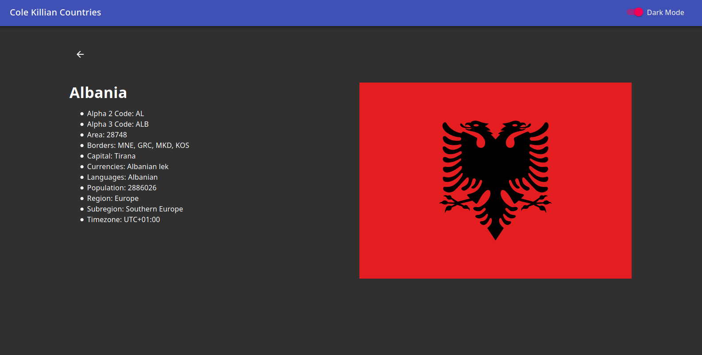
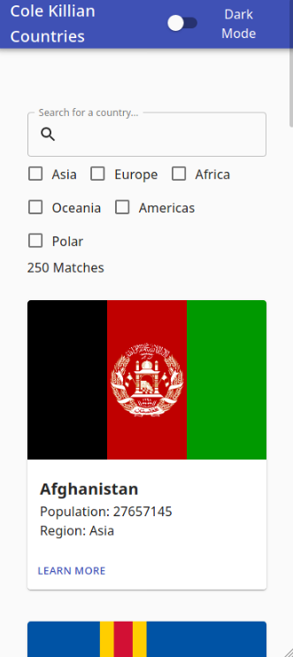
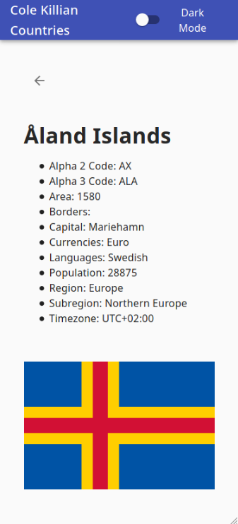

# Features

This is a web project that displays simple country data retrieved from the public REST Countries API (<https://restcountries.eu>).

-   Displays all the countries with a grid of cards. Each card allows a user to visualize the flag image, the name, the population, and the region.
-   A text field for filtering countries by name.
-   A form group of checkboxes for filtering countries by region.
-   The ability to click on a country's card in order to display the full information about that country.
-   Lazy loading. This means that rather than displaying all 250 countries at once, it only displays a few at first. Then when the user scrolls down it loads more into the display.
-   Theme switching (dark and light).
-   Responsive web design (mobile and desktop).
-   An indication of the number of matching countries.
-   A basic custom favicon.

# Usage

This project was built with Create React App and Material-UI.

Use the following commands for running the app locally:

-   **`yard install`:** Run this command first to install the node packages.
-   **`yarn start`:** Runs the app in development mode.
-   **`yarn build`:** Builds the app for production to the `build` folder.

Alternatively, find it at <https://ruborcalor.github.io/countries>

# Screenshots

# Components

## CountryDashboard

Displays the search text field, the region filter, the number of matching countries, and the CountryCardGrid.

## CountryCardGrid

Displays a grid of country cards.

## CountryCard

A card that displays a country's flag, name, population, and region.

## CountryView

Displays a country's name, flag, and all of the information about that country.

## SimpleAppBar

Displays an app bar at the top of the page with the app's title and a switch for toggling the theme between light and dark mode.
